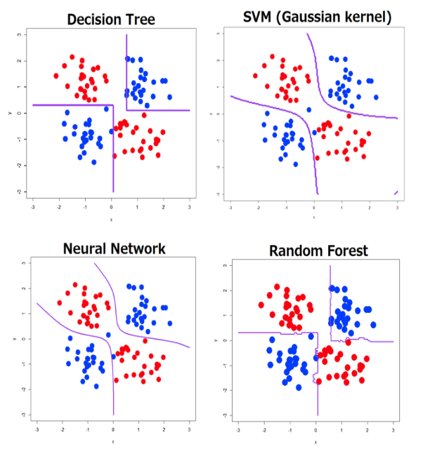
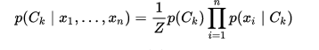
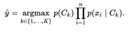
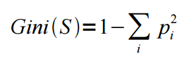
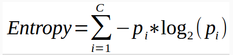

# SVM

1. Classification and regression

2. Uses Hinge loss

3. Evaluated using maximum margin

4. SVM with no kernel is similar to Logistic Regression

5. Math: Convex optimization and Hillbert space theory

6. Hard margin -> Kernel trick -> Soft margin

7. Similar to Linear regression, but you apply a kernel functionto have non linear decision boundaries

8. Non parametric (grows with sample space)

9. Hyper parameters: "right" kernel, regularization penalties, the slack variable

10. One svm for each class

### When to use it

Pros:

1. Works with non linearly seperable data when used with kernels

2. SVMs don’t penalize examples for which the correct decision is made with sufficient confidence. This may be good for generalization.

3. SVMs have a nice dual form, giving sparse solutions when using the kernel trick? (better scalability). 

# Naive Bayes

Bayes therom:

=>

Denominator is indepedant of C, so it is constant. 

Numerator corresponds to chain rule for each feature or joint probability=>

Naive approach assumes that p(x0/x1..xn,C) = p(x/C), that is each feature is conditionally independant of every other feature. So it can said as

1. Training: Calculate probabilities for each class versus feature at training

    1. P(Ck) for all classes

    2. P(x/Ck) for all values of x for all features for every class

        1. nb_dict[class][feature] = dict(x_val, prob)

2. Use it at inference time

# KNN

Simple non parametric supervised method used for classification and regression

* Distance metric: 

    *  For real-valued data, the Euclidean distance can be used. 

    * Other other types of data such as categorical or binary data, Hamming distance can be used.

* In the case of regression problems, the average of the predicted attribute may be returned.

* In the case of classification, the most prevalent class may be returned

*  instance-based lazy learning algorithm

* [Implement](https://machinelearningmastery.com/tutorial-to-implement-k-nearest-neighbors-in-python-from-scratch/)

Def Predict(x):

Candidates = find_knn(x)

Return processed(candidates)

Def find_knn(trainingSet, testInstance, k):

Loop through all data points->calculate distance->keep track of top k

# Decision trees

* Work well with non linear relations. TODO: Be able to explain why

### How it works

* IP: Continuous or descrete

* OP: Can be used for both regression and classification tasks

* Find best split point at each level

    * Split nodes by all possible features and select one which increases homogenuity in children

    * Greedy. Only looks at current best split

* And keep splitting

* Pre-pruning: Stopping condition like until node contains more than 50 samples.

* Knobs: Prune (post) to avoid overfitting

### Split strategies for Classification

1. Gini impurity: Ideal split = 0

    1. Calculate the metric for each child and weight them by #child/total children to get metric at split point.

2. Information gain: Ideal split = Entropy = 0

    2. Calculate the metric for each child and weight them by #child/total children to get metric at split point.

    3. Entropy  = 0 for completely homogenous/pure node, 1 for equal split

    4. Information gain = 1 - Entropy

3. Chi square: 

    5. **((Actual – Expected)^2 / Expected)^½ for each child and class. **

    6. And add all of them for calcualting chi square for the spit.

### Split strategies for Regression

1. Reduction in variance

    1. Variance = sum (x - xmean)^2/n for each node

    2. Variance of split = Weighted sum of each node

2. MSE?

### Handle overfitting

1. Constraints (Greedy, only consider current state)/ Pre-pruning

    1. Min samples for node_split/terminal node

    2. Max Depth of tree and number of terminal nodes

    3. Max features, Rule of thumb = sqrt(total_num_feats). Max :30-40%

2. Post - Pruning: Let the tree grow, and prune the nodes with negative information gain?

    4. Sckikit learn does not support post-pruning. XGBoost does.

    5. Error(post merge) < error(pre merge) => merge/prune

### When to use it

Advantages:

1. Mimics human intuition. Easy to interpret to non statisticians

2. Can be used to find significant features or create new features

3. Less sensitive to outliers. Why? And missing values. Why?

4. Non parametric and hence have no assumptions of the distribution of the data.

5. Better handles non linearity

6. Captures Order?

Disadvantages:

1. Overfitting. But can use pruning and set constaints

2. Not fit for continous variables. Loosed information when it categorizes variables in different categories. Why?

3. Can become unstable - small variations to training can result in completely different trees?

### Action items

1. Try decision sckikit learn

    1. Identify significant variables

2. Understand splits in Regression Decision trees

Final points:

* A good implementation would take following parameters

    * Split strategy

    * Constraints

    * Pruning strategy

* Knobs: 

    * mac_depth, max observations etc

    * Minimum impurity

# Ensemble approaches - Bagging

* Better accuracy and stability

* Bagging: Use multiple classifiers/models on random samples (with replacemnt) of the training data and take avg/mean/mode of predictions

* Bootstrap: Repeated sampling with replacement

Cons of bagging:

* Can lead to highly correlated/identical trees, which can lead to false confidence of overfitted features

# Random forests

* Random forests: It  is a bagging method on bootstrapped samples and take y^ as average of y^ from all trees

* Handles highly correlated trees by only using (random) subset of features for each tree rather than subsets of data

* Can calculate out-of-bag errors instead of using train/test set, like k-fold validation?

* Can be used for Regression and classification

* Non parametric (grows with sample space)

* No hyper parameters except num of trees

* One forest for all classes

Notes:

* Also does dimensionality reduction - by identifying strong features?

* Handles missing values, outliers. How?

* Can be used for unsupervised. How?

* Learning is faster?

Disadvantages:

1. Not very good for regression, as cannot predict out of training range values?

2. Can feel like black box?

3. Inference can be slower?

# Gradient boosting decision trees

* Iteratively learns by combining many weak classifiers to produce a powerful committee

* Also uses bootsrapped sample datasets

* Boosting: Iterative - Each tree learns from the last one

    * Weights each training example by how incorrectly it was classified (or) only works on misclassified samples?

* TODO: Take notes from https://www.youtube.com/watch?time_continue=2&v=sRktKszFmSk

* [https://github.com/dmlc/xgboost/blob/master/doc/parameter.md](https://github.com/dmlc/xgboost/blob/master/doc/parameter.md)

# Unsupervised learning

### Use cases

1. Market segmentation

2. Grouping of news

3. Social network analysis

### When to use

* No labels

* Very high dimensionality

* Detect patterns

* Exploratory step: Can we used to do feature selection as well.

* Find sub groups?

# K-means 

Initialize centroids

Until convergence

	Assign points to centroids

	Recalculate new centroids

Pros:

1. Does not assume underlying distribution? (But assumes Spherical?)

2. Can work in many dimensions

Cons:

1. Need to pick k, assumes existence of underlying groupings

2. Feature engineering - only accepts numeric normalized features

Finding right k:

* If we underfit, too many dissimilar samples migh be in same group - over generalization

* If we overfit, too specific groups that new samples might not fall into

* Elbow plot is useful to find the sweet spot (number of clusters versus sum of squares within groups)

# Dimensionality reduction

https://www.kaggle.com/arthurtok/interactive-intro-to-dimensionality-reduction

PCA: unsupervised

LDA: Supervised

T-SNE: Unsupervised, topology preserving

# Misc:

* Hierarchical clustering

* connectivity based

* A Note on statistical learning versus machine learning:

* In statistical learning you assume some distribution of your data and fit a model

# Comparison of models

## Boosting decision trees versus Random forests:

* Boosting is based on **weak** learners (high bias, low variance). In terms of decision trees, weak learners are shallow trees, sometimes even as small as decision stumps (trees with two leaves). Boosting reduces error mainly by reducing bias (and also to some extent variance, by aggregating the output from many models).

* On the other hand, Random Forest uses as you said **fully grown decision trees** (low bias, high variance). It tackles the error reduction task in the opposite way: by reducing variance. The trees are made uncorrelated to maximize the decrease in variance, but the algorithm cannot reduce bias (which is slightly higher than the bias of an individual tree in the forest). Hence the need for large, unprunned trees, so that the bias is initially as low as possible.

Please note that unlike Boosting (which is sequential), RF grows trees in **parallel**. 

*Weak learner* is a learner that no matter what the distribution over the training data is will always do better than chance, when it tries to label the data. Doing better than chance means we are always going to have an error rate which is less than 1/2.

This means that the learner algorithm is always going to learn something, not always completely accurate i.e., it is *weak and poor* when it comes to learning the relationships between *X*X (inputs) and *Y*Y (target).

[http://fastml.com/what-is-better-gradient-boosted-trees-or-random-forest/](http://fastml.com/what-is-better-gradient-boosted-trees-or-random-forest/)

## **Logistic Regression Pros:**

* Convenient probability scores for observations

* Multi-collinearity is not really an issue and can be countered with L2 regularization to an extent

## **Logistic Regression Cons:**

* Doesn’t perform well when feature space is too large

* Doesn’t handle large number of categorical features/variables well

* Relies on transformations for non-linear features

* Relies on entire data [ Not a very serious drawback I’d say]?

## **Decision Trees Pros:**

* Intuitive Decision Rules

* Can handle non-linear features

* Take into account variable interactions?

## **Decision Trees Cons:**

* Highly biased to training set [Random Forests to your rescue]

* No ranking score as direct result

## **SVM Pros:**

* Can handle large feature space

* Can handle non-linear feature interactions

* Do not rely on entire data?

## **SVM Cons:**

* Not very efficient with large number of observations

* It can be tricky to find appropriate kernel sometimes

# Possible approach in picking a model for classification:

* Always start with logistic regression, if nothing then to use the performance as baseline

* See if decision trees (Random Forests) provide significant improvement. Even if you do not end up using the resultant model, you can use random forest results to remove noisy variables

* Go for SVM if you have large number of features and number of observations are not a limitation for available resources and time

