1. EDA

2. Setup the target: Objective function

3. Preprocessing and feature engineering

4. Setup data split: Train/val/test or train/train-dev/dev/test

5. Simple model:

    1. If starting on a new problem: Start with a simple model. 

    2. If well studied problem, you might want to start from an existing architecture.

    3. Transfer learning from Task A to B, if: Both task A and B have same input. Could learn low level features from task A. Lot more data for task A compared to task B. Task B data can be in the order of 100 samples or 1 hr data

6. Use Bias/Variance/Error analysis and iterate the model /hyperparameters and evaluation metrics

7. Offline statistical tests, online A/B tests

8. Productionize: serving architecture. If online learning, data input pipeline and training and versioning on model.

# Simple baselines

def random_prediction():

	return train_y[random]

def zero-rule_prediction():

	return max_class or 

return mean or

return moving_avg

# Objective function

J(parameters) which we minimize. Lowest point of the teta versus J(teta) curve below

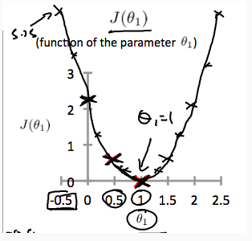

See more[ here](https://keras.io/losses/) at Keras documentation

A scalar metric that evaluates the "goodness"/ "fit" of the model on training data and is evaluated on validation data.

1. Used for the learning process

2. Evaluated on validation data to pick the best model and hyper parameters

## Regression

1. MAE: Normalized L1 norm error(LAE)

2. MSE: Normalized L2 norm error(LSE)

3. RMSE: Penalizes large errors more than small errors. Root makes units of measurement back to original - easy interoretation.

4. R2: Coefficient of determination, also explains variation of the residuals

    1. regression variation/total variation, where total variation = residual variation + regression variation

5. Notes: 

    2. [Different between L1 and L2](http://www.chioka.in/differences-between-l1-and-l2-as-loss-function-and-regularization/)

        1. L1: Robust to outliers?Sparse?Multiple solutions?

## 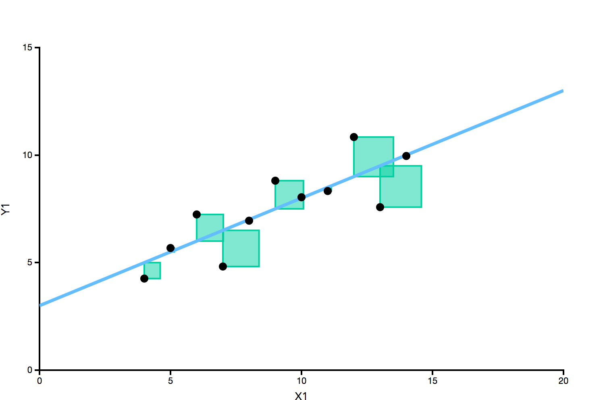MSE is green boxes

## Classification

1. Cross entropy /Log loss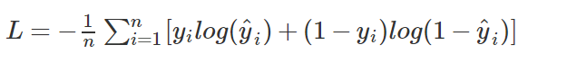

2. Hinge loss:

    1. Absolute Number of errors

    2. No probabilties

    3. Might lead to better accuracy

3. Notes: [Hinge vs log loss](http://yaroslavvb.blogspot.com/2007/06/log-loss-or-hinge-loss.html)

    4. Log loss gives probabilities, so it optimizes for it. So, if acuracy is more important and probabilities are not, hinge loss might perform better.

# Preprocessing

#### Feature scaling

* Contours will be very skewed if not scaled

* Gradient is slower for longer ranges - Takes long time to train

Normalization

Types of data:

1. Continous

2. Discrete

3. Categorical

4. Ordinal

5. Binary

6. Unstructured

7. Anything else?

8. datetime

Questions:

1. Do all models accept all types of data? What kind of preprocessing is required?

# Dataset split and orthogonilization

1. Training set: To fit the model and understand expressivity of the model. Compare with human level performance.

2. Validation set: To pick best model among

    1. Various model.

    2. Hyper parameter tuning

    3. And generalization test on out of training data. 

3. Test set - Unbiased estimate of the model: Test set should be treated as black box, cannot tune anything based on test set results

4. Split based on dataset sizes:

    4. 100/1K/10K/100K => 60/20/20

    5. 100K/1000K => 99/1/1

    6. Test set big enough to give high performance of the system. TODO: Statistical significance?

        1. If confidence is not required then train/valid split might be enough, but not recommended

5. Distributions => valid and test should come from same distribution, otherwise you are shooting wrong targets

    7. If your test data from real use case is small, and you have other bigger dataset to train on, you might want to have different train and valid/test distributions

    8. For example: 200K web cats, 10K mobile cats

        2. Bad split: random shuffle: 205K / 2.5K/2.5K

        3. Better split(diff distributions): 205K(200+5)/2.5(mobile)/2.5(mobile)

    9. Have 4 split: Train, train-dev, dev/valid, test. Where train and train-dev come from the same distribution and dev and test come from same distribution

## Validation set strategies

1. Hold out

2. K-fold cross-validation (better for small datasets, also more robust estimates)

3. Bootstrapping

# Hyper parameter tuning and Debugging?

## Optimization/Learning algorithm

### Gradient descent

1. Derivative is equivalent to slope of tangent at J(teta). It it is positive, move left, else move right

2. Slope is zero when at minimum, hence teta remains unchanged.

3. Takes smaller steps as slope gets closer to zero

4. Finds local minima

Variants

1. Batch

2. Stochastic: Full data in each epoch

    1. Randomize the data in each epoch

    2. Calculate gradient for each sample

3. Mini batch: 

    3. Faster than stochastic, slower than regular

Gradient descent alternatives:

* Conjugate descent

* BFGS

* L-BFGS

TODO: How to check for convergence? When to stop training?

#### Debuging gradient descent

* If loss is not strictly reducing, decrease learning rate

* If loss is decreasing too slowly, increase

# Improving the model: Handling Bias and variance

1. Bias is more: Accuracy on training set is much worser than human level performance/ bayes error

    1. NN: Bigger/better architecture, better optimization, train longer

    2. Traditional ML: Additional features, polynomial features, decrease regularizer parameter gamma  

2. Variance is more: Accuracy on validation is much worser than on training set

    3. Regularization

    4. More training data, data augmentation

    5. Better architecture/hyper parameter search

    6. Traditional ML: Smaller set of features, increrase regularizer parameter gamma

3. Error analysis on validation

    7. Dev set: If % erros due to incorrect labels is significant which makes it hard to chose the right model, then might be better to fix the incorrect labels

        1. Apply same process to dev and test sets to make sure they come from same distribution

    8. Training set: Mislabels in training are not an issue in NN as long we have big enough training set and the mislabels are not systematic

    9. Any specific classes getting wrong? Might have to improve training data 

4. Test performance is bad / Overfitting to dev set

    10. Bigger dev set

5. In the case of 4 way split:

    11. dev accuracy is bad: Data mismatch

        2. Manual analysis of train and valid to see difference and make data more similar(synthesize data), add noise etc. But be careful that you might be simulating only a subset.

6. Performance on real use cases: A/B testing 

    12. Change validation set or change cost function or evaluation metric if A/B tests shows unexpected results

        3. Add class weight term

# Model selection and Evaluation metrics

Objective function without regularization can be used as evaluation metric. But, we might be required to use other metrics as "fit" alone might not be the best indicator of "goodness". Some possible reasons:

1. Error and accuracy give us information on how well we are predicting. But high accuracy does not necessarily mean our model peforms well for following reasons:

    1. Class imbalance: It favors majority class and hence accuracy can be high for imbalanced dataset

    2. It treates importance of predicting all classes equally which might not be true in real world.

2. It treates predicting and not predicting equally. Some types of errors might be more important

3. Interpretability

4. Calibration

5. Scalability

6. Inference time

7. Memory footprint

8. Simple to explain

Note: 

* Have single optimizing metric and possibly a few satisfying metrics

* Single number evaluation metric like F1 score is useful

## Classification metrics

1. RCE (Relative cross entropy): Test on baseline model(For example: 5% of random predict 1), and compare model accuracy with the baseline.

2. Analyzing types of errors:

    1. Confusion matrix: TP, TN, FP, FN

        1. Possible for multi class classification

<table>
  <tr>
    <td></td>
    <td></td>
    <td>Predictions</td>
    <td></td>
    <td></td>
    <td></td>
  </tr>
  <tr>
    <td></td>
    <td></td>
    <td>PP</td>
    <td>NP</td>
    <td></td>
    <td></td>
  </tr>
  <tr>
    <td>Observations</td>
    <td>PO</td>
    <td>TP</td>
    <td>FN</td>
    <td>FNR(Type2)
=FN/PO</td>
    <td>TPR
(Sensitivity/Recall)
=TP/PO</td>
  </tr>
  <tr>
    <td></td>
    <td>NO</td>
    <td>FP</td>
    <td>TN</td>
    <td>FPR(Type1)
=FP/NO</td>
    <td>TNR
(Specificity)
=TN/NO</td>
  </tr>
  <tr>
    <td></td>
    <td></td>
    <td>Precision
=TP/PP</td>
    <td></td>
    <td></td>
    <td></td>
  </tr>
</table>

    2. Precision Recall curve: Recall vs Precision 

    3. ROC curve: Curve represents FPR vs TPR for various thresholds of predicted probability. One curve for each class weight

        2. AUC: Area under ROC curve, single metric representative of "goodness"

    4. F1 score: Score lies between 0 and 1. 1 = best

    5. Other:

        3. Gain and lift chart

        4. K-S chart

        5. MCC

        6. Gini cofficient

        7. Concordant - Discordant ratio

3. Notes: 

    6. PR curve better for imbalanced data

        8. TODO: Discuss and derive why

    7. Use class weights for loss function

    8. Set Classification threshold

    9. Which of these metrics are not optimizable in training? AUC?

## Regression metrics?

# A/B testing?

# Notes

1. Early stopping is a not orthogonal knob. Can afffect fit as well as regularization

2. Class weights can also be learned?

# Appendix

## Confidence interval

TODO: How to do it for linear regression? Predictions on bootstrapped data? To predict how it performs if we collect data again?

## Confusion matrix

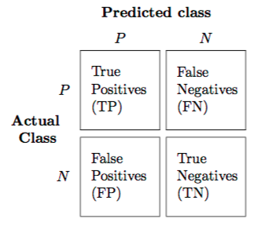

## Error

 F(P+N)/All predictions

* What percent of overall predictions are wrong predictions?

## Accuracy

T(P+N)/All predictions

* What percent of overall predictions are correct predictions?

## False positive rate

* What percent of negative values have been predicted as positive?

* Alpha** (**Type 1 error?)

* **FP/Negative Observations** (or) FP/(TN + FP)

## False negative rate

* What percent of positive samples have been predicted as negative?

* Beta (Type 2 error?)

* **FN/Positive Observations** (or) FN/(TP+FN)

## Specificity or True negative rate

* What percent of negative samples have been correctly labeled negative?

* 1-alpha =>  1-FP/(TN+FP) = **TN/Negative Observations**

## Recall (or) Sensitivity (or) True positive rate

* What percent of positive samples have been correctly labeled positive?

* 1- beta = 1- FN/(TP+FN) = **TP/Positive Observations**

* Use case: Expensive to miss positive cases

## Precision

* Confidence on True prediction

* What percent of positive predictions are actually correct?

* **TP/Positive Predictions **(or) TP/(TP+FP)

* Use case: Expensive to diagnose incorrectly.

## F1-Measure or Harmonic mean

* Harmonic mean of precision and recall

* Equally weights precision and recall

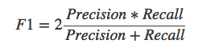

## Precision/ Recall curve and ROC curve:

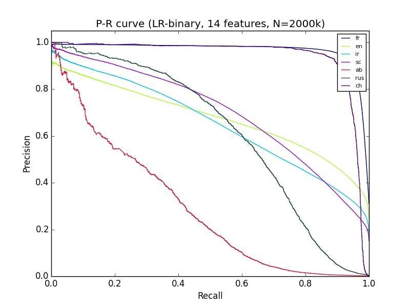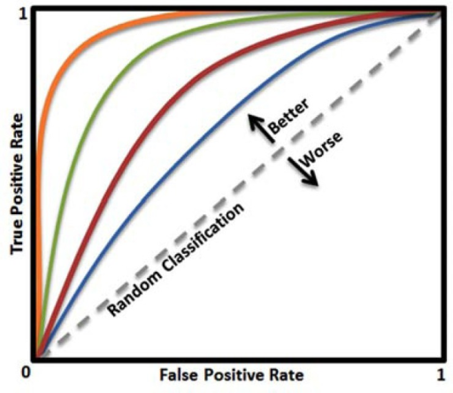

ROC (Receiver Operating Characteristic):

True positive rate (Recall or Sensitivity) versus False positive rate(Type 1 error)

## Average Precision

* Popular in Information Retrieval domain. Used in ordered results. It is the area under the precision recall curve

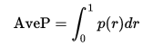

* This integral is in practice replaced with a finite sum over every position in the ranked sequence of documents.

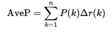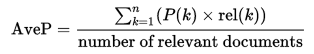

* where k is the rank in the sequence of retrieved documents, n is the number of retrieved documents, P(k) is the precision at cut-off k in the list, rel(k)is an indicator function equaling 1 if the item at rank k is a relevant document, zero otherwise.

* Some authors (PASCAL VOC) choose to interpolate the p(r) function to reduce the impact of "wiggles" in the curve

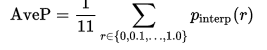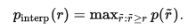

* takes the maximum precision over all recalls greater than r

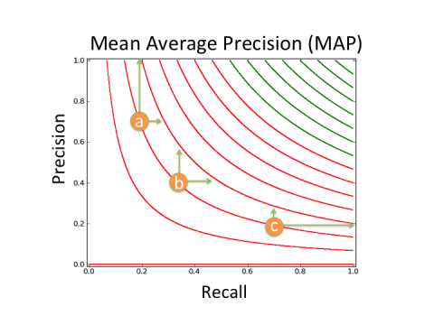

## MAE

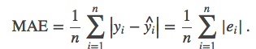

## RMSE

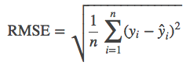

## IoU

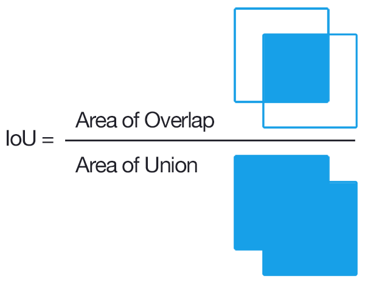

## Mean edit distance / Levenshtein

* Addition/Deletion/Substitution

## NLP metrics

* Perplexity: Lower the better

* Translation: 

    * Bleu: precision based

    * Meteor: Leverages stems

## [CLEAR-MOT](http://www.micc.unifi.it/masi/code/clear-mot/)

* MOT( Multi Object Tracking)

* Code: [https://github.com/glisanti/CLEAR-MOT](https://github.com/glisanti/CLEAR-MOT)

## Correlation values

def beta(x,y) : Captures how sensitive is y with changes to x

def corr_cofficient(x,y) #R: Captures how correlated y is with respect to x, does not capture sensitivity

def corr_determ(x,y) # R^2

## Resources

http://www.ritchieng.com/machine-learning-evaluate-classification-model/

https://github.com/benhamner/Metrics

https://www.kaggle.com/wiki/Metrics

